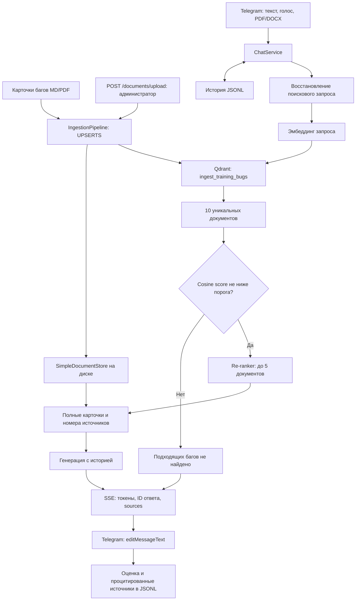

# RAG баг-ассистента — блок 5.3

## Задача

Ассистент помогает операторам находить известные баги и временные решения.
Ответ должен опираться на найденные документы, сохранять номер бага
и учитывать дату создания и статус, когда это требуется вопросом.

Если в документах нет ответа, ассистент сообщает об этом.

## Модели и параметры

- LLM: gpt-4o-mini.
- Эмбеддинги: text-embedding-3-small.
- Размерность: 1536.
- Метрика: COSINE.
- Размер чанка LlamaIndex: 512 токенов.
- Перекрытие: 64 токена.
- Количество извлекаемых фрагментов: 3.
- Начальный порог score: 0.30; требует проверки на тестовых вопросах.

Обе реализации используют одинаковые модели и исходный корпус.
Различия чанкинга будут описаны при сравнении.

## Решение по коллекциям

Рабочая коллекция documents из Б5.2 сохраняется без изменений.

Для LlamaIndex используется rag_block_03.
Она заполнена через LlamaIndex с его форматом нод, включая _node_content.

Для bare-metal используется rag_block_03_baremetal
с плоским payload.

Разделение предотвращает смешивание форматов хранения.
Повторный запуск приложения должен подключаться к готовому индексу,
а не повторно добавлять все документы.

## Корпус

Подготовлено 10 Markdown-файлов в data/rag-block-03/.

Девять файлов содержат баги №110, 135, 142, 162, 167, 172, 191, 194, 200.
Один файл unrelated_plant_care.md содержит посторонний учебный текст
об уходе за растением.

Каждый документ по багу сохраняет номер, дату создания, тему,
статус, влияние, описание и временное решение из исходной базы.

Контрольные вопросы сохранены в tests/eval/rag_questions.json.
Этот файл не включается в индексируемый корпус.

Посторонний документ служит отвлекающим материалом.
Отдельный вопрос вне базы должен не иметь ответа ни в одном
из десяти документов.

## Версии зависимостей
llama-index==0.14.24
llama-index-core==0.14.24
llama-index-vector-stores-qdrant==0.10.3
llama-index-readers-file==0.7.0
llama-index-llms-openai==0.7.10
llama-index-embeddings-openai==0.6.0
qdrant-client==1.19.1
openai==2.45.0

## Прогон 5 вопросов
Состав проверки: **3 хороших / 1 средний / 1 вне базы**.

Хорошие вопросы — №1–3; средний — №4; вне базы — №5.
Для каждого вопроса оценка и гипотеза приведены в таблице результатов.
Одинаковые вопросы проверены на LlamaIndex и bare-metal.
Обе реализации проверены на одинаковых вопросах.
LI — LlamaIndex, BM — bare-metal.
Score — мера сходства, а не вероятность правильного ответа.

### Вопросы

1. После выбора типа оплаты перед печатью чека долго крутится
   анимация загрузки.

2. При регистрации в Милена ЭДО пишет: «Вы уже начали процесс
   регистрации в операторе Милена ЭДО». Повторная заявка не отправляется.

3. Из интеграционного приложения отправили чек более чем на 100 товаров.
   Касса бесконечно печатает новые чеки и отправляет копии в ОФД.

4. После перерегистрации кассы в адресе места расчётов на бумажном
   и электронном чеке вместо значка номера появился доллар.

5. После обновления касса выдаёт ошибку E-9999 при подключении
   весов по Bluetooth.

### Результаты

| № | Тип | Top-1 LI / score | Top-1 BM / score | Краткий ответ обеих реализаций | Оценка и объяснение |
|---|---|---|---|---|---|
| 1 | Хороший | bug_162.md / 0.606 | bug_162.md / 0.662 | Баг 162; не более трёх маркированных товаров в чеке | Релевантно: найден документ с описанием задержки перед печатью |
| 2 | Хороший | bug_191.md / 0.655 | bug_191.md / 0.718 | Баг 191; попробовать позднее; статус «Готова к релизу» | Релевантно: совпадает сообщение об ошибке регистрации; срок исправления не придуман |
| 3 | Хороший | bug_172.md / 0.590 | bug_172.md / 0.626 | Баг 172; «не более 50-ти позиций (максимально 100)» | Релевантно: совпадают повторная фискализация и большой чек; формулировка ограничения сохранена из документа |
| 4 | Средний | bug_167.md / 0.506 | bug_167.md / 0.514 | Найдены 135 и 167; статусы и временные решения представлены отдельно | Поиск релевантен: оба ожидаемых документа в top-3. Отнесение 167 к менее релевантным требует отдельной проверки баллов классификации |
| 5 | Вне базы | bug_135.md / 0.434 | bug_135.md / 0.435 | «Подходящих багов не найдено» | Найденные документы не отвечают на вопрос; отказ корректен |

### Итог

В каждой реализации ожидаемые документы найдены в 4 из 4 вопросов
по корпусу. В среднем вопросе найдены оба ожидаемых источника.
На вопрос вне базы обе реализации вернули корректный отказ.
Во всех ответах присутствуют три элемента sources.

При отказе sources содержит ближайшие найденные фрагменты,
а не подтверждение существования подходящего бага.

В вопросе вне базы top_score выше установленного порога 0.30.
Следовательно, отказ сформирован на этапе генерации, а не
отсечением по порогу сходства. Один этот пример не позволяет
подобрать универсальный порог.

Проверка наличия ожидаемых источников оценивает поиск,
но не доказывает правильность каждого утверждения
и распределения багов по группам релевантности.

### Время ответов

| Вопрос | LlamaIndex через HTTP, сек. | Bare-metal напрямую, сек. |
|---|---:|---:|
| 1 | 23.398 | 5.773 |
| 2 | 46.619 | 3.168 |
| 3 | 45.288 | 2.726 |
| 4 | 44.116 | 2.992 |
| 5 | 43.841 | 1.827 |

Это время полного выполнения в разных условиях вызова.
Результаты не являются чистым сравнением скорости фреймворков.
Для выяснения причин задержки нужны отдельные замеры поиска,
генерации и дополнительных обработчиков HTTP-endpoint.

## Сравнение LlamaIndex и bare-metal

Обе реализации используют одинаковый корпус из 10 документов,
модель эмбеддингов text-embedding-3-small, размерность 1536,
метрику COSINE и генератор gpt-4o-mini.

Коллекции раздельные, поскольку формат хранения фрагментов различается.
Правила ответа баг-ассистента вынесены в общий rag_prompts.py.

| Критерий | LlamaIndex | Bare-metal |
|---|---|---|
| Строк кода индексации и обработки вопроса, включая вспомогательные функции | 291 | 327 |
| Поддержка форматов в текущей реализации | Разрешены MD, TXT, PDF, DOCX; в прогоне проверены MD | Реализованы MD и TXT; PDF/DOCX явно отклоняются |
| Что дописать для PDF/DOCX | Использовать установленные файловые ридеры; проверить извлечение на реальных файлах | Добавить вызовы парсеров PDF/DOCX и преобразование результатов в текст с метаданными |
| Разбиение на фрагменты | SentenceSplitter с параметрами из настроек | Собственная функция split_text с подсчётом токенов и перекрытием |
| Пакетная индексация | Пакетную запись выполняет QdrantVectorStore; установлен размер пакета 128 | Явный цикл по пакетам из 128 фрагментов, получение эмбеддингов и upsert |
| Что дописать для полностью асинхронной обработки | Перевести весь путь на асинхронные методы и клиенты; текущие build/answer синхронные | Использовать асинхронные клиенты Qdrant и LLM, адаптировать получение эмбеддингов |
| Где удобнее отлаживать поиск | В answer доступны найденные nodes и их score; часть обработки скрыта внутри фреймворка | В answer явно видны вектор запроса, query_points, payload, контекст и вызов генератора |
| Источники ответа | Извлекаются из метаданных нод LlamaIndex | Формируются вручную из payload точек |
| Замена компонентов | Есть точки подключения другого chunker, retriever и обработки найденных нод | Любой этап можно изменить напрямую, но соединение компонентов нужно поддерживать самостоятельно |
| Повторный запуск | Подключение через from_vector_store к готовой коллекции | Проверка готовой коллекции и использование существующих точек |
| Ответ при отсутствии подходящего бага | Порог сходства и инструкции генератору | Порог сходства и те же инструкции генератору |

### Как подсчитаны строки

Подсчитаны непустые физические строки кода выбранных функций,
без комментариев, docstring и импортов.
Строки многострочных выражений считаются отдельно.

Для rag.py учтены:
_validate_settings, _load_documents, _check_collection, build, answer.

Для rag_baremetal.py учтены:
split_text, _prepare_chunks, _ensure_collection, build, answer.

Конструкторы, закрытие ресурсов, адаптер CachedEmbedding,
общий сервис эмбеддингов, промпты и HTTP-маршрут в подсчёт не включены.
Это сравнение объёма реализации индексации и запросов,
а не всего приложения.

### Выбор для дипломного проекта

Для дальнейшего развития диплома выбираю LlamaIndex:
он уже подключён к POST /rag/query и позволяет расширять
обработку документов и этапы поиска через готовые компоненты.
При этом сохраняю собственный сервис эмбеддингов с кешем
и настройками подключения через прокси.
Bare-metal оставляю как контрольную реализацию, в которой
легче проследить путь от вопроса до найденных фрагментов и промпта.
В текущем прогоне обе реализации нашли ожидаемые документы
и корректно ответили отказом на вопрос вне базы.
Выбор LlamaIndex основан на удобстве дальнейшего развития,
а не на доказанном преимуществе в качестве или скорости.

## Подключение к приложению

POST /rag/query принимает JSON с полем question и возвращает
answer, top_score и sources.

RAGService создаётся один раз на процесс приложения в lifespan
при RAG_ENABLED=true. При повторном запуске используется готовый индекс.

Синхронные build(), answer() и close() вызываются из асинхронного
приложения через run_in_threadpool.

Вопрос и сгенерированный ответ проходят модерацию.
При блокировке ответа источники не возвращаются.

Коллекция documents из Б5.2 сохраняется отдельно.
Текущий RAG использует учебный корпус из 10 документов,
а не всю базу из 103 багов.

## Многоформатная индексация Б5.5

Учебный корпус: 50 документов — 25 Markdown и 25 PDF.
Коллекция: ingest_training_bugs.

Проверка чтения:
50 readable, 0 failed.

Первый запуск:
50 changed, 0 unchanged, 0 failed.
Количество точек Qdrant: 91.

Повторный запуск без изменения файлов:
0 changed, 50 unchanged, 0 failed.
Количество точек Qdrant осталось 91.

Подтверждены чтение двух форматов, сохранение состояния docstore
между запусками и отсутствие дублей при повторной индексации.

Обновление изменённого документа и обработка повреждённых файлов
этим прогоном отдельно не проверялись.

## Проверка отказа

Текст отказа для баг-ассистента:
«Подходящих багов не найдено».

Используются два уровня защиты:
1. Кодовый score-guard до генерации.
2. Инструкция модели не придумывать баги при отсутствии
   подходящих карточек в контексте.

### Результаты проверки

| Проверка | Порог | Результат | Score-guard |
|---|---:|---|---|
| Запрос вне базы: «Как пересадить домашний кактус в другой горшок?» | 0.30 | Обработка остановлена до генерации; в журнале llm_called=false | Сработал |
| «При округлении скидка применяется и к табаку» при временном тестовом пороге | 1.00 | top_score=0.502; «Подходящих багов не найдено»; confident=false; sources=[] | Сработал |
| Тот же запрос после восстановления рабочего порога | 0.30 | Подходящий баг снова найден | Не сработал |

Тестовый порог 1.00 использовался только для проверки кодового отказа. После проверки восстановлен рабочий порог 0.30.

При срабатывании score-guard модель генерации не вызывается: это подтверждено полем llm_called=false в журнале backend.
Вычисление эмбеддинга вопроса при отсутствии его в кеше может требовать обращения к API.

Порог 0.30 пока является стартовым значением.
Проверки подтверждают работу механизма отказа, но не заменяют калибровку порога на наборе релевантных и нерелевантных запросов.

## Telegram и обратная связь

- Текстовый запрос обрабатывается через RAG.
- Ответ обновляется через editMessageText с интервалом
  не менее 0.8 секунды между операциями вывода.
- Финальное оформление ответа проверено.
- Уточнение «А для них?» сохраняет предыдущий контекст поиска.
- Оценка старого ответа работает после перезапуска бота.
- Оценки сохраняются в JSONL; вместе с ними сохраняются
  источники, процитированные в ответе.
- Ссылки [1], [2] являются номерами источников, а не URL.
  Реальные адреса внутренней базы не публикуются.

## Проверка обращений с вложениями

| Сценарий | Ожидаемый результат | Фактический результат |
|---|---|---|
| Голос: скидка применяется к табаку | Найден баг 147 | Заполнить после проверки |
| PDF с обращением, без подписи | Найден баг 147 | Заполнить после проверки |
| DOCX с обращением, без подписи | Найден баг 147 | Заполнить после проверки |
| «А для них?» после DOCX | Сохранён предыдущий поиск | Заполнить после проверки |
| Отправка вложений боту | Число точек базы не изменилось | Заполнить после проверки |

Вложения операторов используются для поиска и не индексируются
как новые знания. Пополнение базы выполняется отдельно через
административный POST /documents/upload.

Фото пока обрабатываются прежней мультимодальной веткой;
подключение этой ветки к RAG ещё не выполнено.

## Схема RAG Б5.5

## Параметры

- Embedding-модель: text-embedding-3-small.
- Размерность: 1536.
- Метрика: COSINE.
- Разбиение: semantic с дополнительным разбиением длинных фрагментов.
- Максимальный размер дополнительного разбиения: 512 токенов.
- Перекрытие: 32 токена.
- Retrieval: 10 уникальных документов.
- Re-ranker: BAAI/bge-reranker-v2-m3.
- После re-ranker: до 5 документов.
- Стартовый score threshold: 0.30.

Порог применяется к cosine-оценке retrieval, а не к оценке re-ranker.
Полноценная калибровка порога на распределении релевантных
и нерелевантных запросов ещё не завершена.

## Запуск Docker Compose

Подготовлен стек app + qdrant + redis + bot.

Перед стартом FastAPI автоматически запускается ingestion.
При неизменном корпусе повторный запуск должен показывать
0 changed, N unchanged.

История JSONL, docstore и кеши хранятся в volume chat-data.
Векторы — в qdrant_storage.
Корпус подключается из папки data на машине запуска.
Redis использует redis-data.

Секреты передаются через окружение; .env не включается в образ.

Фактическая сборка и запуск Docker Compose пока НЕ проверены:
на локальном Windows-ПК Docker недоступен.
Успешный локальный запуск Python не считается проверкой Compose.

## Оставшиеся ограничения

- Фото пока обрабатываются прежней мультимодальной веткой,
  без нового RAG-поиска.
- Восстановление короткого уточнения реализовано для явно перечисленных фраз; универсальный LLM-condense не включён.
- BackgroundTasks не является устойчивой очередью:
  после аварийного завершения незавершённую загрузку нужно повторить.
- Номера цитат не являются публичными URL.
- Перед публичным размещением нужны отдельная проверка доступа к chat-endpoint'ам, HTTPS и настройка резервного копирования.

## Проверка повреждённого PDF

Дата проверки: 2026-09-27.

Создан файл ingestion_failure_test.pdf с обычным текстом вместо настоящего PDF. Запущена индексация только этого файла.

Результат:
- Парсер обнаружил повреждение: FileDataError.
- В журнале появилось событие file_parse_failed.
- Файл автоматически переименован в ingestion_failure_test.pdf.failed.
- Ошибка блокировки Windows WinError 32 не повторилась.
- Индексация не выполнялась: единственный входной документ оказался непригодным.

Завершение с сообщением «Нет документов, пригодных для индексации» ожидаемо для этого отрицательного теста.

Для устранения блокировки исходного файла PDF читается через PyMuPDF из байтов в памяти, с закрытием документа через контекстный менеджер. Обёртка PyMuPDFReader заменена прямым использованием PyMuPDF.

После изменения проверено чтение корректного bug_147.pdf:
1 readable, 0 failed. Проверка выполнена в режиме --check, без индексации и сетевых embedding-запросов.

## Предварительная калибровка score-guard

Дата: 2026-09-28.

Отчёт: score_threshold_20260928_175508_023685.json.

Использованы 11 запросов:
- 7 запросов с эталонными багами в текущей коллекции;
- 4 запроса явно вне предметной области.

Измерялся максимальный cosine score retrieval.
Генерация ответов и re-ranker не вызывались.
Порог применяется до re-ranker и генерации:
при top_score < RAG_SCORE_THRESHOLD возвращается
«Подходящих багов не найдено».

### Распределение оценок

| Группа | Количество | Минимум | Медиана | Максимум |
|---|---:|---:|---:|---:|
| С подходящими багами | 7 | 0.4239 | 0.4850 | 0.6338 |
| Без подходящих багов | 4 | 0.1932 | 0.2138 | 0.2901 |

### Сравнение порогов

| Порог | Отсечено запросов с багами | Пропущено запросов без багов |
|---|---:|---:|
| 0.20 | 0/7 | 2/4 |
| 0.25 | 0/7 | 1/4 |
| 0.30 | 0/7 | 0/4 |
| 0.35 | 0/7 | 0/4 |
| 0.40 | 0/7 | 0/4 |
| 0.45 | 3/7 | 0/4 |
| 0.50 | 4/7 | 0/4 |

Для всех 7 положительных запросов среди кандидатов присутствовал
хотя бы один эталонный баг.

### Решение

Оставляю RAG_SCORE_THRESHOLD=0.30.
На проверенном наборе он не блокирует положительные запросы и отсекает все отрицательные. Повышение до 0.35 или 0.40 не даёт улучшения на этой выборке, а 0.45 приводит к потере части положительных запросов.

### Ограничения проверки

Набор небольшой, отрицательные запросы явно отличаются
от обращений о багах. Результаты не доказывают, что порог отсекает похожие на баг обращения, которым нет соответствия в базе.

Максимальная отрицательная оценка 0.2901 близка к порогу 0.30.
Для дальнейшей калибровки нужны сложные отрицательные примеры и отдельная проверочная выборка, не использованная при подборе.

Score отражает близость текстов, а не вероятность правильности.
После изменения корпуса или embedding-модели проверку необходимо повторить.

## Статус самопроверки Б5.5

Проверено локально:
- Индексация 50+ документов в форматах MD/PDF.
- Повторная индексация без увеличения числа точек
  при неизменном корпусе.
- Обработка повреждённого PDF с переименованием в .failed.
- POST /rag/query: ответ, источники, цитаты и confident.
- Score-guard и отказ без вызова модели генерации.
- Предварительное обоснование порога по распределению score.
- POST /documents/upload: принятие файла и фоновая индексация.
- Диалоговый SSE с финальным событием sources.
- Уточнение «А для них?» с сохранением контекста поиска.
- Telegram-вывод через редактирование сообщения.
- Feedback с источниками, включая оценку после перезапуска бота.

Подготовлено, но не проверено запуском:
- Docker Compose: app + qdrant + redis + bot.

Ограничения:
- Фото пока обрабатываются прежней мультимодальной веткой, без нового RAG-поиска.
- Универсальное переписывание уточнений через LLM-condense не реализовано; поддерживаются явно перечисленные фразы.
- Нужна дальнейшая калибровка на сложных отрицательных запросах.